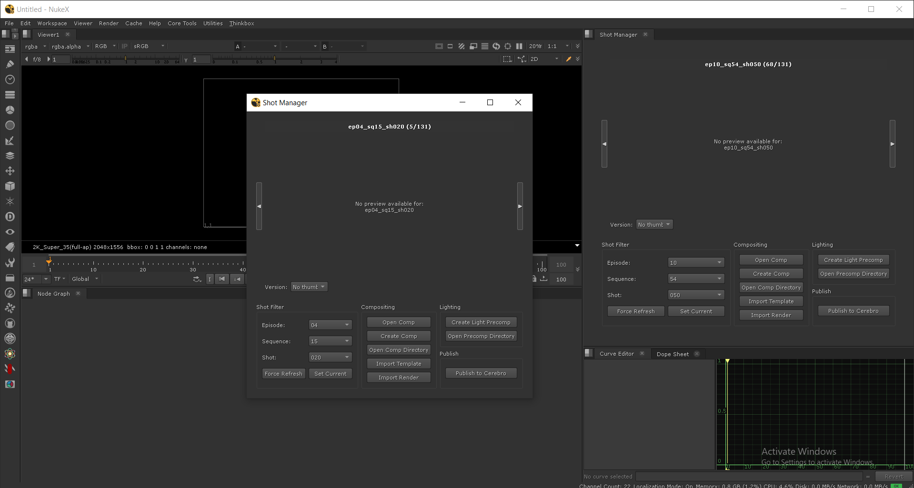
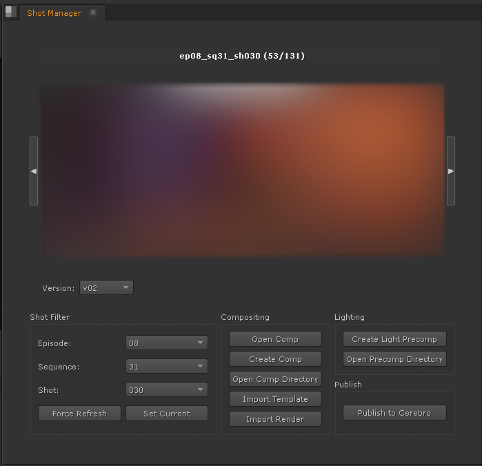

# Cinderella — Nuke Pipeline Tools

A compositing pipeline toolkit built for **Foundry Nuke**, centered around the **Shot Manager panel** — a PySide2 dock widget that gives artists a full shot navigation, script management, and production tracking interface directly inside the compositor.

Version 2.0 introduces a FastAPI backend that handles all heavy lifting (shot scanning, thumbnail generation, script creation, production tracker integration), keeping the Nuke panel thin and studio-agnostic.





---

## What It Does

The Shot Manager panel lets artists:

- Browse and filter shots by episode, sequence, and shot number
- Create new comp scripts and light precomp scripts from templates
- Import the latest render layers and camera alembic into the current script
- Generate shot thumbnails via ffmpeg
- Connect to a production tracker (ShotGrid, ftrack) to read and set task statuses, and post daily reports
- Submit render jobs to Deadline

All studio-specific configuration (server paths, naming conventions, tracker credentials) lives in a `.env` file — no hardcoded values anywhere in the codebase.

---

## Architecture

```
Nuke (DCC host)
└── python/shot_manager/shot_manager_panel.py   ← PySide2 panel (UI only)
    └── python/shot_manager/pipeline_client.py  ← thin HTTP client
        └── HTTP → FastAPI backend (pipeline-backend/)
                   ├── Shot discovery & caching
                   ├── Thumbnail generation (ffmpeg)
                   ├── Comp / precomp script creation
                   └── Production tracker integration
```

The panel never touches the filesystem or the tracker directly. Every data call goes through `PipelineClient`, which talks to the backend over HTTP. `BASE_URL` defaults to `http://localhost:8000` but can be pointed at a shared studio server via the `PIPELINE_BASE_URL` environment variable.

---

## Repository Structure

```
cinderella/
├── python/                         # v2 Nuke-side tools (active)
│   ├── shot_manager/
│   │   ├── shot_manager_panel.py   # PySide2 Shot Manager panel
│   │   └── pipeline_client.py      # HTTP client wrapping all API calls
│   ├── tools/
│   │   ├── import_tools.py         # Import render layers, camera, template
│   │   ├── write_path.py           # Set Write node paths from backend
│   │   └── workflow_tools.py       # Reload reads, extract light passes, etc.
│   ├── deadline/
│   │   └── submitter.py            # Deadline job submission
│   └── backend_startup.py          # Auto-starts Docker backend on Nuke launch
│
├── pipeline-backend/               # FastAPI backend service
│   ├── app/
│   │   ├── main.py                 # FastAPI app + /health endpoint
│   │   ├── config.py               # Pydantic BaseSettings (all env-driven)
│   │   ├── models/schemas.py       # Pydantic request/response models
│   │   ├── routers/
│   │   │   ├── shots.py            # GET /shots, GET /shots/{id}, POST /shots/scan
│   │   │   ├── thumbnails.py       # GET /shots/{id}/thumbnail
│   │   │   ├── scripts.py          # POST /shots/{id}/comp-script, precomp-script
│   │   │   └── tracker.py          # GET /tracker/statuses, tasks, status, report
│   │   └── services/
│   │       ├── shot_scanner.py     # Filesystem walker with JSON cache
│   │       ├── thumbnail_service.py
│   │       ├── script_service.py
│   │       ├── tracker_service.py  # Facade over tracker adapters
│   │       └── tracker/
│   │           ├── base.py         # ProductionTracker ABC
│   │           ├── shotgrid.py     # ShotGrid adapter
│   │           ├── ftrack.py       # ftrack adapter
│   │           ├── null.py         # No-op when tracker is unconfigured
│   │           └── factory.py      # Returns the right adapter from config
│   ├── Dockerfile
│   ├── docker-compose.yml
│   ├── requirements.txt
│   └── .env.example
│
├── scripts/                        # v1 legacy tools (kept for reference)
├── plugins/                        # Third-party Nuke plugins
├── gizmos/                         # Custom .gizmo files
├── toolsets/                       # Nuke toolset .nk files
├── init.py                         # Nuke plugin path setup
└── menu.py                         # Nuke menu registration + backend startup
```

---

## API Endpoints

| Method | Endpoint | Description |
|--------|----------|-------------|
| `GET` | `/health` | Server status, render path reachability, tracker status |
| `GET` | `/shots` | List shots; filter with `?ep=01&sq=05` |
| `GET` | `/shots/{shot_id}` | Shot detail + render layers |
| `POST` | `/shots/scan` | Force rescan, invalidate cache |
| `GET` | `/shots/{shot_id}/thumbnail` | Return or generate thumbnail via ffmpeg |
| `POST` | `/shots/{shot_id}/comp-script` | Create versioned comp `.nk` from template |
| `POST` | `/shots/{shot_id}/precomp-script` | Create versioned light precomp `.nk` |
| `GET` | `/tracker/statuses` | List task statuses from production tracker |
| `GET` | `/tracker/shots/{shot_id}/tasks` | Get tasks for a shot |
| `POST` | `/tracker/shots/{shot_id}/status` | Set task status |
| `POST` | `/tracker/shots/{shot_id}/report` | Post a daily report with optional attachments |

---

## Studio Deployment

### 1. Clone and configure

```bash
git clone <repo> cinderella
cd cinderella/pipeline-backend
cp .env.example .env
```

Edit `.env` with your studio's paths:

```env
RENDER_PATH=//192.168.1.100/prj/show/render
COMP_PATH=//192.168.1.100/prj/show/comp
CACHE_PATH_NEW=//192.168.1.100/prj/show/cache
```

### 2. Start the backend

```bash
docker-compose up -d
```

That's it. The backend mounts your render/comp/cache volumes read-only/read-write as appropriate and exposes port `8000`.

### 3. Point Nuke at the backend

By default each artist's Nuke points to `http://localhost:8000`. To use a shared studio server instead, set the environment variable before launching Nuke:

```bash
set PIPELINE_BASE_URL=http://192.168.1.50:8000   # Windows
export PIPELINE_BASE_URL=http://192.168.1.50:8000  # Linux/Mac
```

Or add it to your site's Nuke environment wrapper.

When Nuke launches, `menu.py` automatically pings `/health` and starts the Docker container if it isn't already running.

---

## Shot Naming Convention

The scanner uses a configurable regex to discover shots. The default matches `ep01/sq05/sh001`:

```env
SHOT_PATTERN=ep(?P<ep>\d+)[/\\]sq(?P<sq>\d+)[/\\]sh(?P<sh>\d+)
SHOT_ID_FORMAT=ep{ep}_sq{sq}_sh{sh}
SHOT_DIR_FORMAT=ep{ep}/sq{sq}/sh{sh}
```

To adapt to a different convention (e.g. `s01/e02/c001`), change only those three lines — no code changes needed:

```env
SHOT_PATTERN=s(?P<ep>\d+)[/\\]e(?P<sq>\d+)[/\\]c(?P<sh>\d+)
SHOT_ID_FORMAT=s{ep}_e{sq}_c{sh}
SHOT_DIR_FORMAT=s{ep}/e{sq}/c{sh}
```

---

## Production Tracker Setup

Set `TRACKER_BACKEND` to `shotgrid` or `ftrack`. All tracker endpoints return `503` when it's unset — the rest of the backend continues working normally.

### ShotGrid

```env
TRACKER_BACKEND=shotgrid
TRACKER_URL=https://mystudio.shotgrid.autodesk.com
TRACKER_SCRIPT_NAME=pipeline_bot       # Admin > Scripts
TRACKER_API_KEY=your_api_key
TRACKER_PROJECT=MyShow
TRACKER_TASK_TYPE=Comp                 # optional step filter
```

Requires: `pip install shotgun_api3`

### ftrack

```env
TRACKER_BACKEND=ftrack
TRACKER_URL=https://mystudio.ftrackapp.com
TRACKER_SCRIPT_NAME=apiuser@studio.com
TRACKER_API_KEY=your_api_key
TRACKER_PROJECT=MyShow
TRACKER_TASK_TYPE=Comp
```

Requires: `pip install ftrack-python-api`

---

## Nuke Script Templates

Comp and precomp scripts are created from `.nk` templates. The backend injects the correct render read paths and write paths automatically.

```env
TEMPLATE_COMP_PATH=/tools/templates/comp_template.nk
TEMPLATE_PRECOMP_PATH=/tools/templates/precomp_template.nk
```

If unset, a minimal stub `.nk` is created instead.

---

## Requirements

**Backend**
- Python 3.11+
- Docker + docker-compose
- ffmpeg (included in the Docker image)

**Nuke side**
- Nuke 14+ with PySide2
- `requests` in Nuke's Python environment (`pip install requests` into Nuke's Python)
- Deadline client (optional, for job submission)
